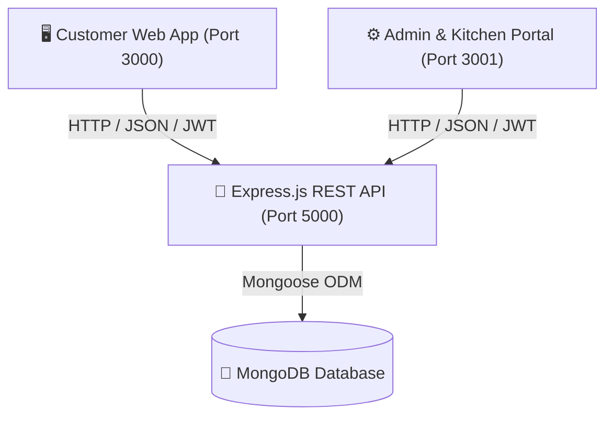

# 🍽️ Restaurant Management System (Full-Stack MERN)

[](https://react.dev/)
[](https://vitejs.dev/)
[](https://nodejs.org/)
[](https://www.mongodb.com/)
[](LICENSE)

A modern, high-performance, and feature-complete **Restaurant Management & Food Ordering Platform** built using the MERN stack (**MongoDB, Express.js, React 19, Node.js**), powered by **Vite** and styled with a sleek glassmorphic UI.

---

## 🌟 System Architecture Overview

The repository is modularized into three dedicated layers:



---

## 🚀 Key Features

### 1. 🖥️ Customer Portal (`FRONTEND` - Port 3000)
- **Interactive Digital Menu**:
  - Filter by **Cuisine** (*Authentic Indian* & *Exquisite Chinese*).
  - Filter by **Category** (*Starters*, *Main Course*, *Sides*, *Desserts*, *Beverages*).
  - Dietary filters (**Pure Veg / Non-Veg**) & **Spice Level** badges (*Mild*, *Medium*, *Spicy*).
  - Real-time search with instant filtering.
  - Star ratings and customer review submission.
- **Smart Cart & Ordering**:
  - Add to cart with quantity controls and customizable cooking instructions / notes.
  - Select Dining Type: **Dine-in (Select Available Table)**, **Takeaway**, or **Delivery**.
  - Dynamic invoice calculation (Subtotal, 5% GST, Platform / Delivery fees, Discounts).
- **Real-Time Order Tracking**:
  - Visual status timeline: `Pending` ➔ `Preparing` ➔ `Ready` ➔ `Served / Delivered`.
  - Order cancellation before preparation starts.
  - Interactive online payment simulator & status indicators.
- **Table Booking & Reservations**:
  - Choose reservation date, time slot, guest count, and special requests.
  - Real-time table availability feedback.
- **Authentication & User Profile**:
  - JWT-based user login and registration.
  - Order history with quick re-order links and total spending analytics.

---

### 2. ⚙️ Admin & Kitchen Dashboard (`ADMIN` - Port 3001)
- **Live Kitchen & Order Dispatch System**:
  - Live order feed displaying table numbers, items, special notes, and timestamps.
  - 1-click status transitions: `Pending` ➔ `Preparing` ➔ `Ready` ➔ `Served` ➔ `Cancelled`.
  - Update payment status (`Unpaid` ➔ `Paid`).
  - Generate printable PDF / thermal formatted invoices.
- **Menu Management (CRUD)**:
  - Add new dishes with title, description, price, category, cuisine, veg/non-veg status, spice level, and photo URL.
  - In-place editing and instant availability toggle (Enable/Disable out-of-stock items).
  - Delete menu items with instant UI synchronization.
- **Floor & Table Management**:
  - Visual table floor grid (Tables with capacities 2, 4, 6, 8+ seats).
  - Real-time status toggle: `Available`, `Occupied`, `Reserved`.
  - Add or remove physical tables.
- **Table Reservation Management**:
  - Real-time incoming reservation requests.
  - Confirm or cancel guest bookings with assigned seating.
- **Analytics & Overview Dashboard**:
  - Total revenue, live order counts, table occupancy rates, and pending reservation metrics.

---

### 3. 🛡️ Backend & Database (`BACKEND` - Port 5000)
- **Node.js & Express 5 REST API**.
- **MongoDB Atlas & Mongoose 9 ODM** schema models.
- **JWT Authentication & Bcrypt Password Hashing**.
- **Role-Based Access Control** (`customer`, `admin`, `staff`).
- **Automated Database Seeding**: Pre-loads rich Indian and Chinese dishes with high-definition imagery and table layouts on first launch.

---

## 📂 Project Directory Structure

```text
Restaurent management/
├── ADMIN/                     # Admin & Kitchen Management Portal (Vite + React 19)
│   ├── src/
│   │   ├── components/        # Navigation, Sidebar & UI components
│   │   ├── context/           # Admin Authentication State (AdminAuthContext)
│   │   ├── pages/             # Dashboard, AdminOrders, AdminMenu, AdminTables, AdminReservations, Login
│   │   ├── App.jsx
│   │   └── main.jsx
│   └── package.json           # Runs on http://localhost:3001
│
├── BACKEND/                   # Node.js + Express REST API
│   ├── src/
│   │   ├── config/            # DB Connection & Auto-Seed Database Configuration
│   │   ├── controllers/       # Auth, Menu, Orders, Tables, Reservations logic
│   │   ├── middleware/        # JWT Authentication & Admin verification
│   │   ├── models/            # User, MenuItem, Order, Table, Reservation schemas
│   │   ├── routes/            # Express endpoint routers
│   │   └── index.js           # Server entry point
│   ├── .env.example           # Environment variables template
│   └── package.json           # Runs on http://localhost:5000
│
├── FRONTEND/                  # Customer Facing Web App (Vite + React 19)
│   ├── src/
│   │   ├── assets/            # Static assets and icons
│   │   ├── components/        # Navbar, Footer, FoodCard, Cart, etc.
│   │   ├── context/           # User AuthContext & CartContext
│   │   ├── pages/             # Home, Menu, CartPage, BookingPage, OrderStatus, Orders, Login, Register
│   │   ├── App.jsx
│   │   └── main.jsx
│   └── package.json           # Runs on http://localhost:3000
│
├── .gitignore
└── README.md
```

---

## 🛠️ Tech Stack & Dependencies

| Area | Technologies |
| :--- | :--- |
| **Frontend & Admin UI** | React 19, Vite, React Router DOM 7, Lucide React Icons |
| **Styling** | Vanilla CSS (Modern Design System, CSS Variables, Glassmorphism, Responsive Grid) |
| **Backend** | Node.js, Express.js 5.x, CORS |
| **Database** | MongoDB Atlas, Mongoose 9.x |
| **Security & Auth** | JSON Web Tokens (JWT), Bcrypt password hashing |

---

## ⚡ Quick Start & Installation

### 1. Prerequisites
- **Node.js** (v18.x or later)
- **npm** or **yarn** / **pnpm**
- **MongoDB Atlas** connection string (or local MongoDB instance)

---

### 2. Backend Setup
1. Navigate to the `BACKEND` directory:
   ```bash
   cd BACKEND
   ```
2. Install backend dependencies:
   ```bash
   npm install
   ```
3. Create your `.env` configuration:
   ```bash
   cp .env.example .env
   ```
4. Configure `.env` variables:
   ```env
   PORT=5000
   MONGO_URI=your_mongodb_connection_string
   JWT_SECRET=your_jwt_secret_key_here
   JWT_EXPIRE=30d
   ```
5. Start the backend server:
   ```bash
   npm run dev
   ```
   *The server will start at `http://localhost:5000` and automatically seed initial menu items and tables.*

---

### 3. Customer Web App Setup
1. Open a new terminal and navigate to `FRONTEND`:
   ```bash
   cd FRONTEND
   ```
2. Install frontend dependencies:
   ```bash
   npm install
   ```
3. Start the customer portal:
   ```bash
   npm run dev
   ```
   *The Customer portal will run at: `http://localhost:3000`*

---

### 4. Admin & Kitchen Portal Setup
1. Open a new terminal and navigate to `ADMIN`:
   ```bash
   cd ADMIN
   ```
2. Install admin dependencies:
   ```bash
   npm install
   ```
3. Start the admin portal:
   ```bash
   npm run dev
   ```
   *The Admin portal will run at: `http://localhost:3001`*

---

## 🔐 Default Admin Credentials

When running the project for the first time, you can sign in to the Admin Portal (`http://localhost:3001/login`) using the built-in seed option or the credentials below:

- **Email:** `admin@restaurant.com`
- **Password:** `AdminPassword123!`
- **Role:** `admin`

*(If the admin user doesn't exist yet, click the **"Quick Seed Admin Account"** button on the Admin Login screen).*

---

## 📡 REST API Endpoints Reference

### Authentication (`/api/auth`)
- `POST /api/auth/register` - Register a customer account
- `POST /api/auth/login` - Authenticate user & receive JWT
- `GET  /api/auth/me` - Get current logged-in user profile
- `POST /api/auth/seed-admin` - Bootstrap the initial admin user

### Menu Management (`/api/menu`)
- `GET    /api/menu` - Fetch all menu items (Supports query filters)
- `POST   /api/menu` - Create new menu item *(Admin only)*
- `PUT    /api/menu/:id` - Update menu item details *(Admin only)*
- `DELETE /api/menu/:id` - Delete a menu item *(Admin only)*
- `POST   /api/menu/:id/rate` - Submit customer rating & review

### Orders (`/api/orders`)
- `POST   /api/orders` - Place a new order
- `GET    /api/orders` - Get all restaurant orders *(Admin/Staff)*
- `GET    /api/orders/my-orders` - Fetch orders for logged-in user
- `GET    /api/orders/:id` - Get order details by ID
- `PUT    /api/orders/:id/status` - Update order status (`Pending`, `Preparing`, `Ready`, `Served`, `Cancelled`)
- `PUT    /api/orders/:id/payment` - Update payment status (`Unpaid`, `Paid`)
- `PUT    /api/orders/:id/pay-online` - Simulate payment gateway completion
- `PUT    /api/orders/:id/cancel-user` - Cancel order by customer

### Tables (`/api/tables`)
- `GET    /api/tables` - Fetch list of all tables and statuses
- `POST   /api/tables` - Create a new table *(Admin)*
- `PUT    /api/tables/:id` - Update table status or details *(Admin)*
- `DELETE /api/tables/:id` - Remove a table *(Admin)*

### Reservations (`/api/reservations`)
- `POST   /api/reservations` - Create a table reservation request
- `GET    /api/reservations` - List all reservations *(Admin)*
- `PUT    /api/reservations/:id` - Update reservation status (`Confirmed`, `Cancelled`, `Completed`)

---

## 🤝 Contributing

Contributions, issues, and feature requests are welcome!
1. Fork the Project
2. Create your Feature Branch (`git checkout -b feature/AmazingFeature`)
3. Commit your Changes (`git commit -m 'Add some AmazingFeature'`)
4. Push to the Branch (`git push origin feature/AmazingFeature`)
5. Open a Pull Request

---

## 📄 License

This project is open source and available under the [MIT License](LICENSE).
